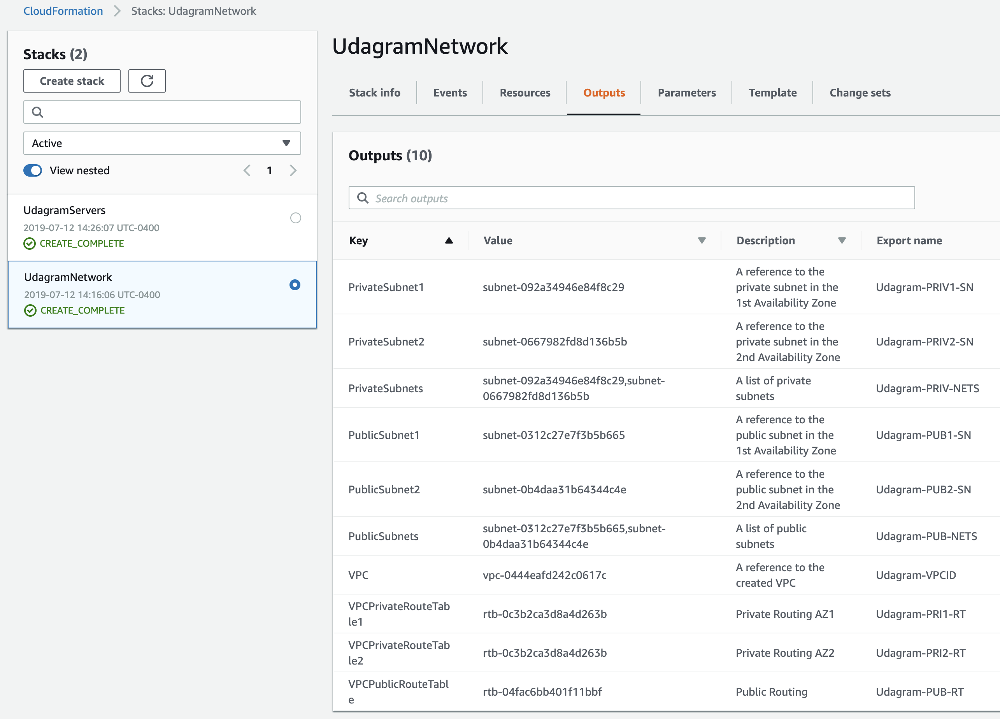
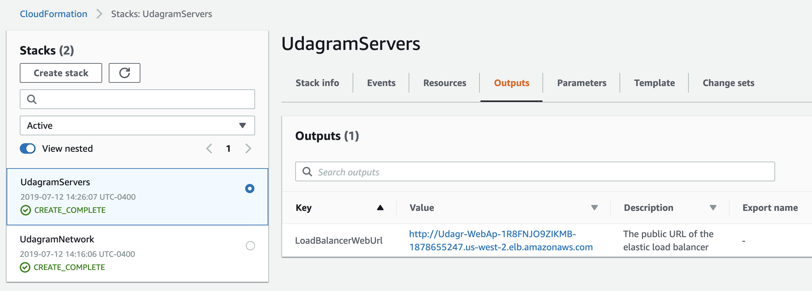

# Udacity-Project-2
This project consists of the assets required to deploy the *Udagram* web application to Amazon Web Services (AWS).

## Project-Specific Requirements
* 2x Availability Zones (AZ)
* 1x public, 1x private Subnet per AZ
* 4x Auto-Scaled instances of Ubuntu 18 LTS located in private subnets listening on TCP port 80 proxied by Elastic Load Balancer (ELB)
* ELB located in public subnets listening on TCP port 80

## CloudFormation
There are 2 configuration files, one for the network architecture and one for the server deployment, both with corresponding parameter files:
* [udagram-network.yml](udagram_network.yml)
  * [network-params.json](network-params.json)
* [udagram-servers.yml](udagram_servers.yml)
  * [server-params.json](server-params.json)

The CLI commands used to create both stacks, in order:
```
aws cloudformation create-stack --stack-name UdagramNetwork --template-body file://udagram-network.yml --parameters file://network-params.json --region=us-west-2

aws cloudformation create-stack --stack-name UdagramServers --template-body file://udagram-servers.yml --parameters file://server-params.json --capabilities CAPABILITY_NAMED_IAM  --region=us-west-2
```
**Network Stack output:**
<!-- .element height="40%" width="40%" -->

**Servers Stack output:**
<!-- .element height="40%" width="40%" -->

## S3
The web application deployables and service configuration files copied from a specified non-public S3 bucket by the EC2 instances (see **UserData** in *WebAppLaunchConfig*) can be found in the [S3](S3) folder.

## Spring Boot (Java)
The web application is powered by [Spring Framework for Java](https://spring.io/projects/spring-framework) and specifically uses [Spring Boot](https://spring.io/projects/spring-boot) to provide a deployable package that includes an embedded [Apache Tomcat](https://tomcat.apache.org/) server. The source code is located in [SpringBootUdagram](SpringBootUdagram).
